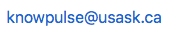

Once you have your data file ready to be uploaded, please get in touch with us via . One of us will help to set up all the details and register you under your project. This setup step allows the raw phenotypic importer to generate a customized data collection spreadsheet to collect your data. 
We will need to collect all the following details from your project traits:

- **Name**
- **Trait Rep/Stages**
- **Unit**
- **Definition**

In the next episode, you will learn how to enter your data in the category column headers.
