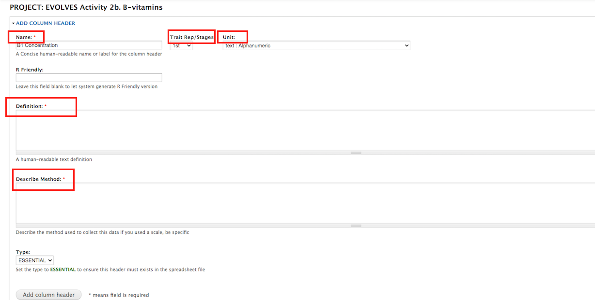

The screenshot below shows an example of the information we collect if you need to add a new trait.
To create new column headers (new variables) for your experiment, we need to know the **Name**, **Trait Rep/Stages**, **Unit**, **Definition**, and **Describe Method** for each of your trait as shown in the picture.

This step allows the raw phenotypic importer to generate customized  data collection spreadsheet to collect your data. 
