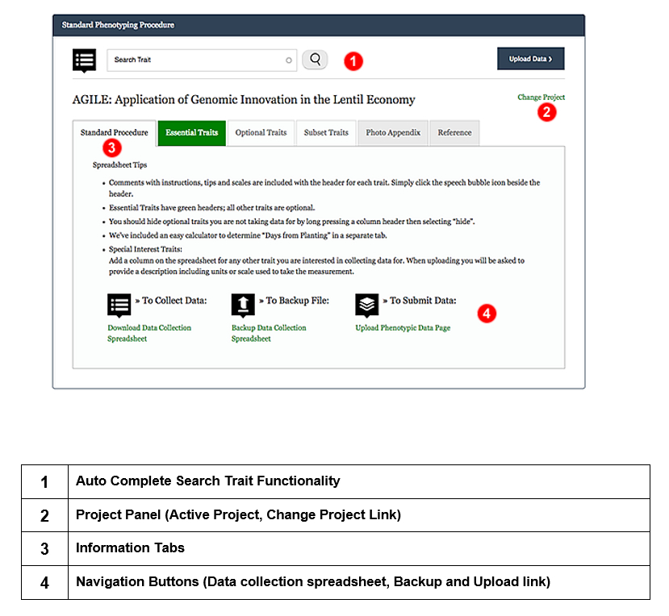

## Download Data Collection Spreadsheet 

Data collection spreadsheet can be downloaded from [Standard Phenotyping Procedure](https://knowpulse.usask.ca/phenotypes/raw/instructions). Choose your project from the dropdown before you click on **Download Data Collection Spreadsheet** on the bottom left corner. 

You will get a data collection spreadsheet as showing in the screenshot.

A to E are default columns, follow by your traits. If any of these default traits don't apply to your data, fill the column with n/a. In the name column, all your names must match the existing germplasm names in KnowPulse.

Please note, each project can only handle one data collection spreadsheet, therefore, if you intend to upload multiple files, please contact us. 
