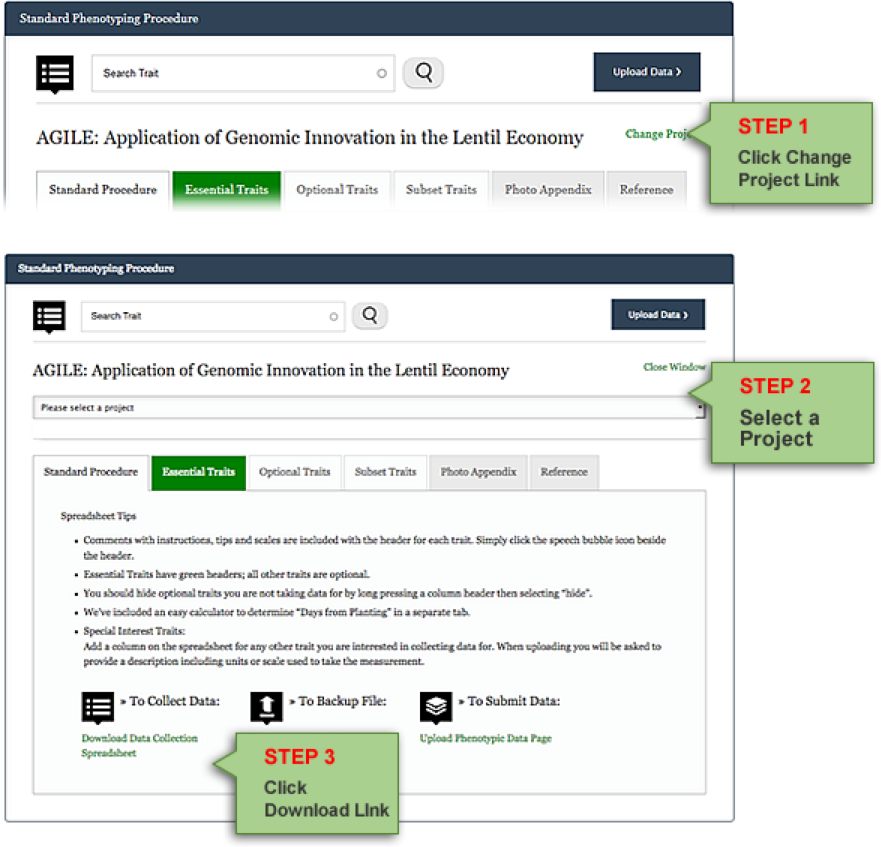
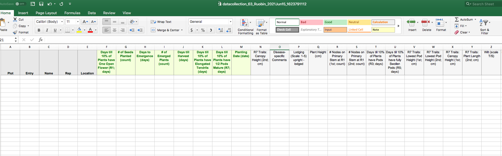

## How to download data collection spreadsheet file
Data collection spreadsheet can be downloaded from [Standard Phenotyping Procedure](https://knowpulse.usask.ca/phenotypes/raw/instructions) (requires log in to access).

1.	Click **Change Project** link, located next the project title of the currently active project to show **Change Project Form**.
2.	Select a project when prompted. The instructions page will reload with a new active project. This will ensure that you are downloading the data collection spreadsheet file corresponding to a project that you are working on.
3.	Click the **Download Data Collection Spreadsheet** link in the Standard Procedure Tab to begin file download. Click save when prompted.

## You will get a data collection spreadsheet as shown in the screenshot.

Columns A to E are default headers, followed by one column per trait. If any of these default traits do not apply to your data, fill the column with n/a. In the name column, all your names must match the existing germplasm names in KnowPulse. There is another tutorial to guide you through the [Germplasm Search](https://knowpulse-knowledgebase.github.io/Germplasm-Search/) process. If your germplasm does not exist in KnowPulse yet, please contact us.

**Please note, each project can only handle one data collection spreadsheet, therefore, if you think you will need to upload multiple files, please contact us.**
