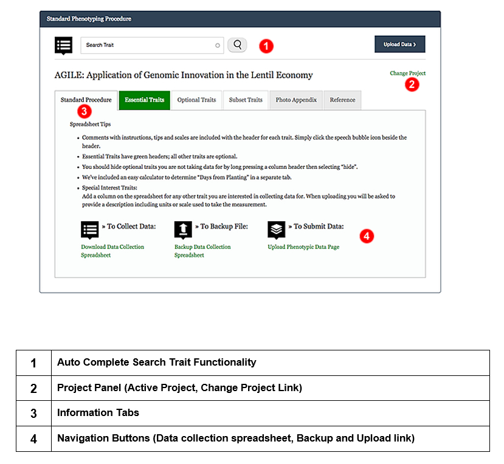
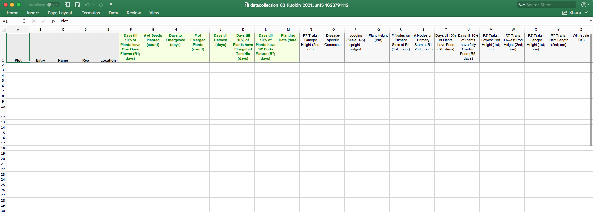

## Download Data Collection Spreadsheet 

Data collection spreadsheet can be downloaded from [Standard Phenotyping Procedure](https://knowpulse.usask.ca/phenotypes/raw/instructions)(needs log in to access). Choose your project from the dropdown before you click on **Download Data Collection Spreadsheet** on the bottom left corner. 

You will get a data collection spreadsheet as showing in the screenshot.

A to E are default columns, followed by one column per trait. If any of these default traits don't apply to your data, fill the column with n/a. In the name column, all your names must match the existing germplasm names in KnowPulse. There is another tutorial to guide you through the [Germplasm Search](https://knowpulse-knowledgebase.github.io/Germplasm-Search/) process.

Please note, each project can only handle one data collection spreadsheet, therefore, if you think you will need to upload multiple files, please contact us. 
