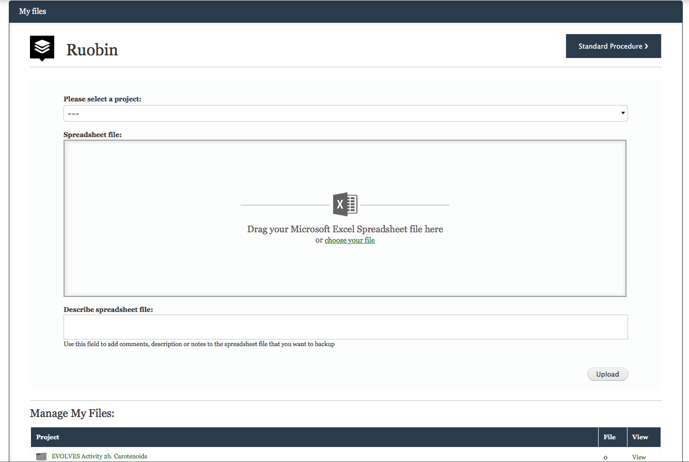
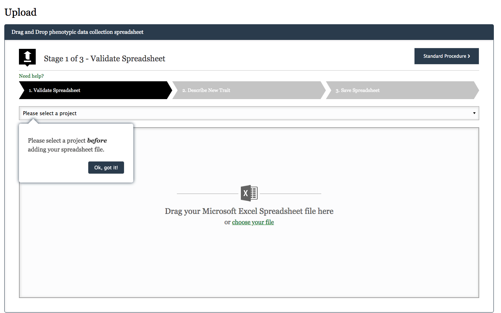

## Data Backup
[Data backup function](https://knowpulse.usask.ca/phenotypes/raw/backup) allows you to backup multiple versions of your raw phenotypic data files into the KnowPulse during the growing season.  Click [here](https://knowpulse.usask.ca/portal/sites/default/files/tutorial_files/rawpheno_videos/rawpheno_backup.mp4) to view a detailed video instruction to learn the data backup procedure. 

You can also access data backup section through the **My Raw Phenotypes** panel.

## Data Upload
The data uploading process takes three steps.

### 1. Validate Spreadsheet 
This stage is designed to ensure your data file meets all the requirements from the importer. Validation errors may be detected in the file and you want to fix them according to the validation result. Click [here](https://knowpulse.usask.ca/portal/sites/default/files/tutorial_files/rawpheno_videos/rawpheno_upload_validation.mp4) to view more troubleshooting instructions. 

### 2. Describe New Trait
At this stage, your spreadsheet is examined for additional phenotypes. This step has done already during project setup.

### 3. Save Spreadsheet 
You will get feedback once your file has been uploaded successfully, click on bottom right **Next Step** to store your file. 
