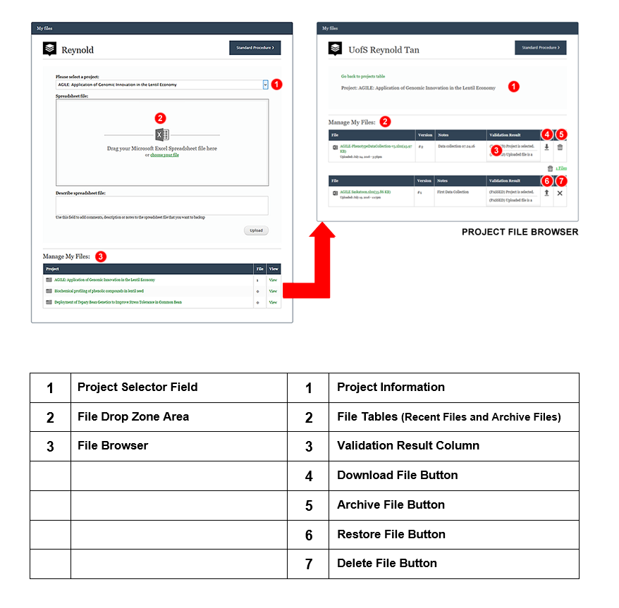
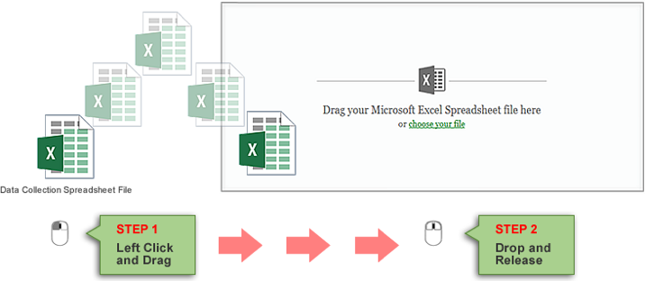

# Data backup
[Data backup function](https://knowpulse.usask.ca/phenotypes/raw/backup) (requires login to access) allows you to backup multiple versions of your raw phenotypic data files into the KnowPulse during the growing season. 

**Please note, your data file needs to be saved as Excel Workbooks (.xlsx).**

## How to back up your data
1. Select the project that corresponds to data collection spreadsheet file. 
2. Then drag and drop your file to the **File Drop Zone Area** or click choose file to launch file browser window (See Figure 1 below). 
3. A text box for describing data collection in its current state is provided to make it easier to reference back to if needed. 

You can view all your files in **Manage My Files** section.

Click [here](https://knowpulse.usask.ca/portal/sites/default/files/tutorial_files/rawpheno_videos/rawpheno_backup.mp4) (requires log in to access) to see a detailed video instruction to learn the data backup procedure.  

## How to archive, restore and delete a file
1.	In File Browser, click the Trash Bin icon to archive a file.  will indicate that there are archive files in a project.
2.	Click Archive file indicator to disclose archive files table.
3.	In archive files table, options to restore file and physically delete file will become available. You will be prompted to confirm any action to a file.

                                            **Figure 1. Drag and drop a file**

