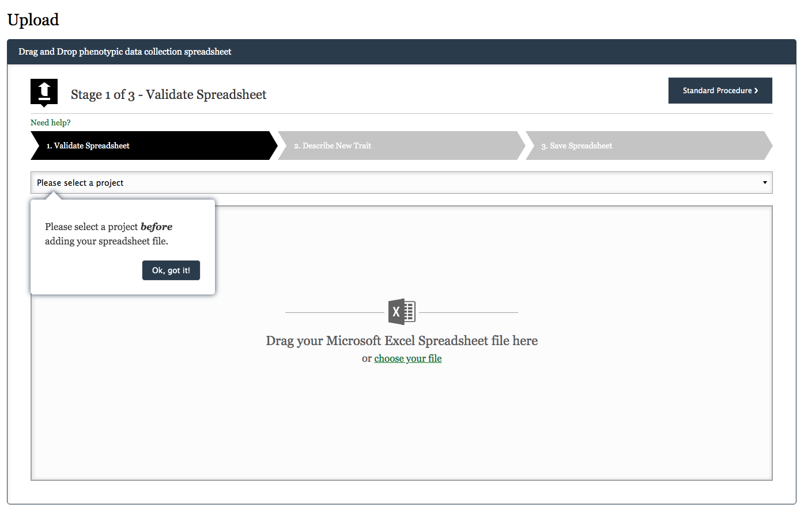

## Data backup
[Data backup function](https://knowpulse.usask.ca/phenotypes/raw/backup) (needs login to access) allows you to backup multiple versions of your raw phenotypic data files into the KnowPulse during the growing season. 

**Please note, your data file needs to be saved as Excel Workbooks (.xlsx).**

To back up your data, first, select the project that corresponds to data collection spreadsheet file. Then drag and drop your file to the File Drop Zone Area or click choose file to launch file browser window. A text box for describing data collection in its current state is provided to make it easier to reference back to if needed. You can view all your files in **Manage My Files** section.

Click [here](https://knowpulse.usask.ca/portal/sites/default/files/tutorial_files/rawpheno_videos/rawpheno_backup.mp4) to see a detailed video instruction to learn the data backup procedure.  

## Archive, restore and delete a file
To archive a file, you need to click the Trash Bin icon (see point 5). The trash icon will indicate that there are archive files in a project. Click Archive file indicator to disclose archive files table. In archive files table, options to restore file and physically delete file will become available. You will be prompted to confirm any action to a file.

## Upload data
The data uploading process takes three steps.

### 1. Validate Spreadsheet 
This stage is designed to ensure your data file meets all the requirements from the importer. Validation errors may be detected in the file and you want to fix them according to the validation result. Click [here](https://knowpulse.usask.ca/portal/sites/default/files/tutorial_files/rawpheno_videos/rawpheno_upload_validation.mp4) to view more troubleshooting instructions. 

### 2. Describe New Trait
At this stage, your spreadsheet is examined for additional phenotypes. New trait(s) will be detected in your spreadsheet at this stage, and you are requested to add description(s) for new trait(s).

### 3. Save Spreadsheet 
You will get feedback once your file has been uploaded successfully, click on bottom right **Next Step** to store your file. 

## Download data
In File Browser, click the name of the file link under the File column or the download icon (arrow pointing down) to start file download. Click save file when prompted.

