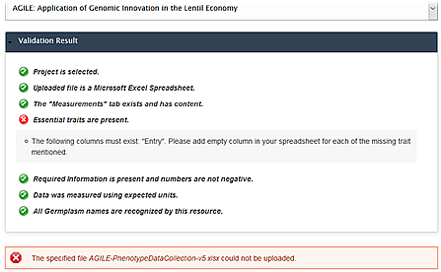

After your data collection spreadsheet file is properly filled, it is time to upload it. 

## How to upload data file

1.	Select the project that corresponds to data collection spreadsheet file.
2.	Drag and Drop file to the File Drop Zone Area or click **choose file** to launch file browser window as shown in the screenshot. 
3.	The upload process will initiate once a valid file is detected in the File Drop Zone Area. At this stage, you will be notified whether the file has passed or failed basic compliance test.

### 3.1. Validate Spreadsheet 
This stage is designed to ensure your data file meets all the requirements from the importer. Validation errors may be detected in the file as shown and you want to fix them according to the validation result.

**Click [here](https://knowpulse.usask.ca/portal/sites/default/files/tutorial_files/rawpheno_videos/rawpheno_upload_validation.mp4) to view more troubleshooting instructions.** 

### 3.2. Describe New Trait
At this stage, your spreadsheet is examined for additional phenotypes. New trait(s) will be detected in your spreadsheet at this stage, and you are requested to add description(s) for new trait(s). If there are no additional traits found, you may proceed to the next stage where spreadsheet file and data are stored.

### 3.3. Save Spreadsheet 
You will get feedback once your file has been uploaded successfully, click on bottom right **Next Step** to store your file. 

**It is important to note that it is only when the progress bar reaches 100% and the status becomes Completed! that data will become available in Raw Phenotypic Data Page and Download Data Page.**

