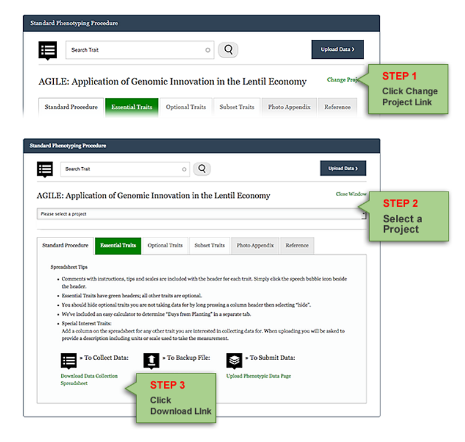

## View your data
Your data is summarized in an interactive diagram showing the growing year(s) and location(s) [Raw Phenotypic Data](https://knowpulse.usask.ca/phenotypes/raw). 

## Download your data
To download your data,  click **Download Data** on the top right corner to load download data page, then choose your project and define conditions or filters to apply when generating the data. Hit on **Download** button on bottom right when you are ready. 

By now, your data file has been downloaded successfully, congratulation! 

## Helps and more

This is the end of the tutorial. All the data collecting, uploading, and downloading instructions from previous episodes can also be found in a [video demonstration format](https://knowpulse.usask.ca/node/1772530). 

If you need further clarification on any issue or encounter any technical difficulties, please get in touch with us. 
