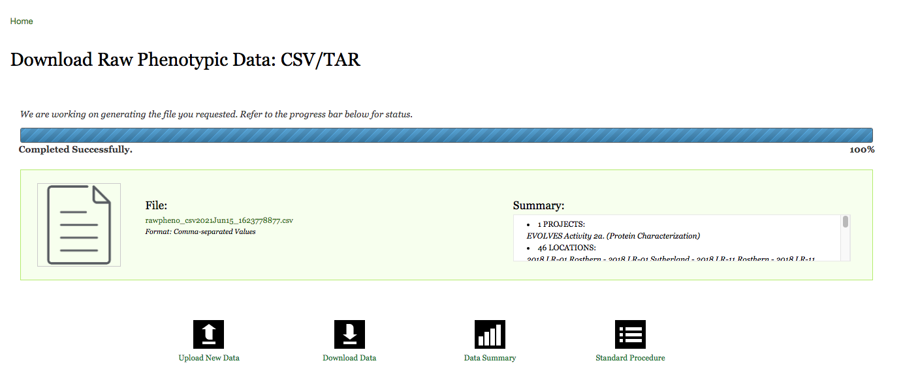

## How to download phenotypic data 

1.	Select a project from **Project Selector Field**. To download all data from all available project, select **All Projects**.
2.	Select location from **Location Selector Field**. To select all locations, click the select all locations checkbox.
3.	Select **Traits** from **Trait Selector Field**. To select all traits, click the select all trait checkbox.
4.	Check other download option and click **Download** button to begin file download.

**Data generated from this page is in comma separated or CSV format and is R and Microsoft Excel compatible.**

## Download progress

1.	Click File link in **File summary window** when file download process is complete.	

2.	Click Ok when prompted to save file.
