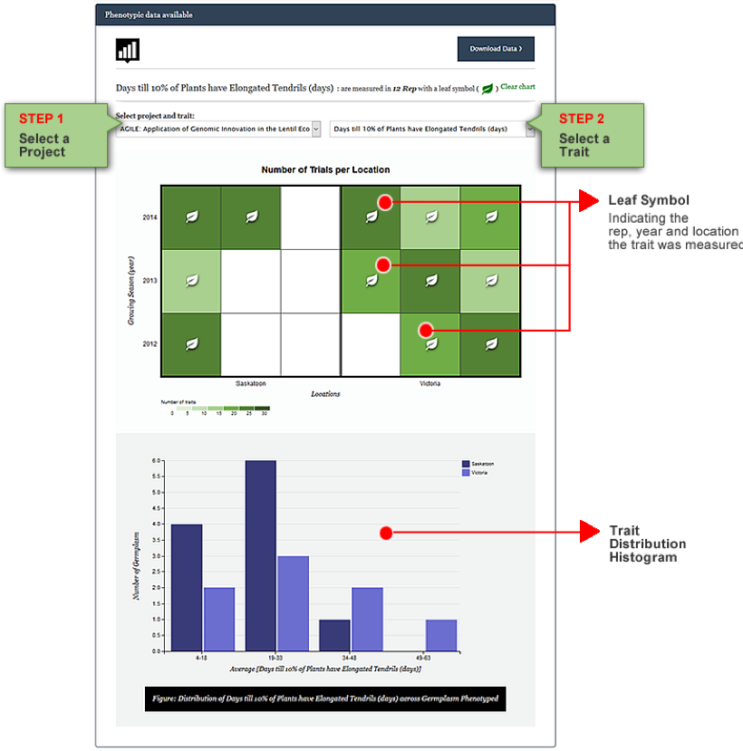

## How to highlight a trait of interest and create trait distribution histogram
Your data will be summarized in an interactive diagram that shows the growing year(s) and location(s) as shown in the example below [Raw Phenotypic Data](https://knowpulse.usask.ca/phenotypes/raw) (requires login to access). 

1.	Select a project from **Project Selector Field** to load project-specific column headers/traits.
2.	Select a trait of interest in the **Trait Selector Field**.
3.	The square blocks will be marked by a Leaf Symbol on indicate that the trait was measured in that particular rep, year and location. Below this chart, **Trait Distribution histogram** is generated.

